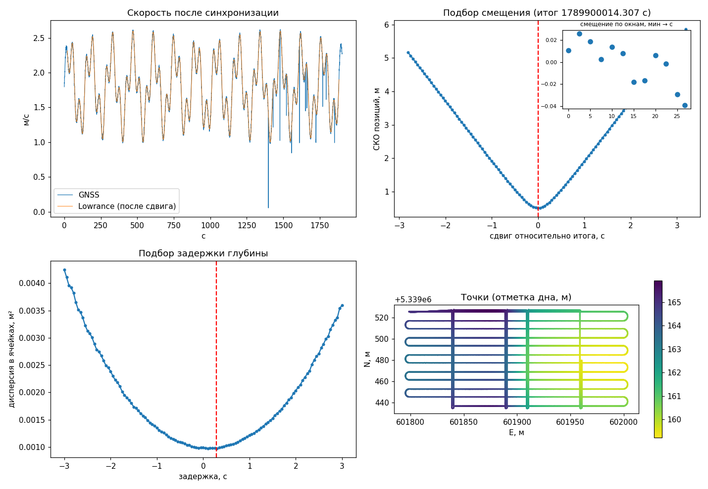

# sl2sync — привязка глубин Lowrance .sl2 к точному GNSS

Контекст задачи, формат sl2, алгоритм и планы: [docs/CONTEXT.md](docs/CONTEXT.md).

## Установка
    pip install -r requirements.txt

## CLI: sl2sync.py
    python sl2sync.py запись.sl2 трек.nmea --lever 0.5 0.3 --draft 0.1 --antenna-height 1.2 --auto-latency

GNSS-трек: NMEA-лог (GGA + RMC/ZDA), RTKLIB .pos (PPK) или CSV с колонками time, lat, lon[, h, q].

### Основные параметры
- `--lever ВПЕРЁД ВПРАВО` — где датчик эхолота относительно GNSS-антенны, м.
- `--draft` — заглубление датчика под водой, м (keel offset в Lowrance поставьте 0).
- `--antenna-height` — высота антенны над водой, м; включает расчёт отметок дна (нужен RTK/PPK).
- `--auto-latency` — подбор остаточной задержки глубины по встречным/пересекающимся галсам.
- `--latency` — задать задержку вручную (если уже измерена).
- `--offset`, `--drift-ppm` — ручная синхронизация, если авто не сработала.
- `--min-fix fix` — брать только точки с RTK FIX.

### Результат (папка <имя>_out)
- `*_points.csv` — точки: время UTC, lat/lon, UTM, глубина, отметка дна, качество GNSS, курс.
- `*_depth.asc` / `*_zbottom.asc` + `.prj` — грид для QGIS (GeoTIFF, если установлен rasterio).
- `*_report.png` — графики синхронизации, подбора задержки и карта точек.
- `*_summary.json` — найденные смещение, дрейф, задержка и статистика.

Пример отчёта:

### Проверка на синтетике
    python make_test_data.py
    python sl2sync.py test.sl2 test_gnss.nmea --lever 0.5 0.3 --draft 0.1 --antenna-height 1.0 --auto-latency

## GUI: gui.py — «ОМДЖЕТ Гидро»
    python gui.py

Настольное окно (PySide6) для быстрого просмотра трека эхолота на карте и подбора
временного смещения перед запуском полного расчёта `sl2sync.py`. Не заменяет CLI —
не считает грид/CSV/отчёт, только показывает данные и помогает подготовиться к запуску.

### Загрузка данных
- **Файл эхограммы (.sl2)** — выбор одного файла сразу показывает трек на карте по
  встроенному GPS Lowrance (без GNSS-трека, без полной синхронизации).
- **Посмотреть эхограмму** — отдельное окно с водопадом сонара по выбранному файлу
  (столбец — пинг, строка — байт от начала записи пинга), раскрашенным той же
  радужной палитрой, что и точки на карте (слабый сигнал — синий, сильный —
  красный), с прокруткой. Формат байт эхограммы нигде не задокументирован и не
  проверен на реальном железе (см. `read_echogram_waterfall` в gui.py и
  docs/CONTEXT.md) — поэтому байты показаны как есть, без домысленной привязки
  к метрам: пробовали растягивать столбец под глубину дна пинга, но реальный
  диапазон сонара автодиапазоном не равен глубине и это давало ложные резкие
  скачки на картинке, только хуже настоящих.
  - Слева — линейка (закреплена у края окна, не уезжает при горизонтальной
    прокрутке), снизу — ось времени/расстояния (настройка «Временная шкала»).
  - Под эхограммой — таймлайн: профиль глубины дна по сонару (depth_m,
    единственное здесь откалиброванное значение), синхронизированный по
    горизонтали с прокруткой.
  - Наведение курсора на эхограмму рисует перекрестие с подписями (строка —
    слева от курсора, время/расстояние — сверху) и подсвечивает то же место
    на таймлайне глубины.
  - Колесо мыши над изображением или линейкой — масштаб (0.1×–20×), ползунок
    «Контраст» — усиление контраста амплитуды.
- **Мультиэхограмма** — загрузка нескольких .sl2 по одному: после каждого файла
  вопрос «Загрузить ещё?» (Да → выбрать следующий, Нет → показать то, что уже
  загружено). Точки всех файлов объединяются на одной карте с общей шкалой окраски
  по глубине.
- **Закрыть эхограммы** — выгружает все загруженные файлы, сбрасывает карту и сводку.
- **GNSS-трек** — выбор одного файла (NMEA/.pos/CSV) для расчёта смещения.
  **Мультитрек** — так же, по одному файлу с вопросом «Загрузить ещё?»; несколько
  треков объединяются в один по времени. **Закрыть** — выгружает GNSS-трек(и).

Диалоги выбора файлов запоминают последнюю открытую папку между запусками программы.

### Расчёт смещения
Кнопка **«Рассчитать смещение»** (активна при выбранных эхограмме и GNSS-треке)
запускает ту же оценку временной привязки, что и `sl2sync.py` (грубое смещение по
кросс-корреляции скорости + уточнение по траектории), и открывает окно с двумя
картами: слева — сырой трек эхолота и GNSS-трек до синхронизации (виден сдвиг),
справа — после (треки должны совпасть). Показывается найденное смещение и СКО
позиций.

### Построение изобат
Кнопка **«Построить изобаты»** (под строкой GNSS-трека) открывает отдельное окно:
карта в центре, настройки слева, кнопка «Построить» снизу.
- **Шаг изобат** и **Ячейка сетки** (интерполяции) — параметры расчёта.
- **«Нарисовать урез воды»** — включает режим рисования: клики по карте добавляют
  точки уреза (глубина 0 м), которые подмешиваются к данным эхолота при построении
  сетки — сонар не измеряет вплотную к берегу, а урез задаёт границу воды и
  заметно улучшает интерполяцию у берега. «Очистить урез» сбрасывает нарисованное.
- **«Построить»** — грид глубин линейной интерполяцией (`scipy.griddata`) и линии
  постоянной глубины через `matplotlib.contour`, отрисованные поверх карты.

### Панели слева от карты (сверху вниз)
- **«Обрезка»** — отрезает точки с начала и с конца трека. Переключатель «Время»
  (секунды от начала записи) / «Расстояние» (метры вдоль трека) — активны только
  поля выбранного режима.
- **«Смещение»** — сдвигает глубину на заданное число сантиметров (например,
  компенсация осадки/выноса датчика). «Для всех» — одно значение на все загруженные
  эхограммы; «Раздельно» — открывает окно со своим смещением для каждого файла
  (по имени).
- **«Сводка»** — блок «Глубины» (макс./мин./средняя по точкам, уже после обрезки и
  смещения) и блок «Дата» (начало, конец, продолжительность трека; при
  мультиэхограмме — прочерк, так как файлы могут быть с разных выходов). Начало/конец
  трека берутся от времени изменения файла .sl2 минус длительность записи —
  абсолютного времени в самом .sl2 нет (см. docs/CONTEXT.md).

Обрезка и смещение пересчитывают карту и сводку сразу, без повторного чтения файлов.

### Карта и таймлайн
- Точки раскрашены радужной палитрой; выпадающий список «Раскраска» переключает,
  по чему красить: **«Глубина»** (минимум — красный, максимум — синий),
  **«Твёрдость дна»** (см. ниже) или **«Нет»** (все точки одним цветом). Легенда —
  вертикальная, тёмная полупрозрачная, в правом нижнем углу карты, с подписанными
  границами диапазона и заголовком текущего слоя.
- Наведение курсора на точку трека на карте показывает её глубину во всплывающей
  подсказке, ставит на это место жёлтый маркер и подсвечивает соответствующее
  место на таймлайне под картой — и наоборот.
- **Таймлайн** под картой — профиль глубины по всем точкам трека с разметкой оси
  (время или расстояние — переключается в настройках). Наведение курсора на
  таймлайн двигает жёлтый маркер по треку на карте и показывает глубину в этой точке.
- Подложка — Google Спутник или Google Карта.

### Твёрдость дна (экспериментально)
При загрузке эхограммы по сырым байтам каждого пинга (см. «Посмотреть эхограмму»)
считается грубый индекс твёрдости дна: резкость/ширина первого пика (резче — твёрже)
и наличие второго эха на удвоенной глубине (сигнал поверхность→дно→поверхность→дно,
обычно заметен только на твёрдом дне). Индекс не откалиброван и не привязан к
реальным типам грунта — это относительный показатель 0..1 для сравнения точек между
собой в пределах одного трека, а не измерение, как у специализированных систем
классификации дна (RoxAnn, QTC, BioSonics). См. `estimate_bottom_hardness_ping` и
`compute_hardness_index` в gui.py.

### Настройки
- **Окраска глубин** — автоматическая (мин/макс берутся с эхограммы, по умолчанию)
  или ручная (свои мин/макс), и число ступеней окраски (2–128, дискретные полосы
  цвета вместо непрерывного градиента).
- **Временная шкала** — разметка оси таймлайна: «Время» (мин:с от начала) или
  «Расстояние» (м/км вдоль трека).
- **Кэш** — текущий размер кэша карт, кнопка «Очистить кэш», отведённый объём под
  кэш (по умолчанию 1024 МБ).
- **Проверить обновления** — сверяет версию с последним релизом на GitHub
  (`andrewkena/omjet-gidro`); при наличии новой версии предлагает открыть страницу
  релиза. При запуске программы такая проверка выполняется автоматически и тихо
  (без окон, если обновлений нет).

### Технические заметки
- Карта встроена через `QWebEngineView` + Leaflet.js. В этом окружении обнаружено,
  что вызов `QWebEngineView` из обработчика, вызванного через `QThread`-сигнал между
  потоками, приводит к падению процесса — поэтому все фоновые операции (чтение
  эхограмм, расчёт смещения, проверка обновлений) используют обычный
  `threading.Thread` с опросом через `QTimer` (`run_async` в gui.py), а не
  `QThread`/`Signal`.
- `QWebEnginePage.setHtml()` молча обрезает контент больше ~2 МБ — при десятках
  тысяч точек карта грузится через временный HTML-файл (`load_html`), с уникальным
  именем на каждую перерисовку (Chromium иначе кэширует `file://` по пути и не видит
  изменений).
