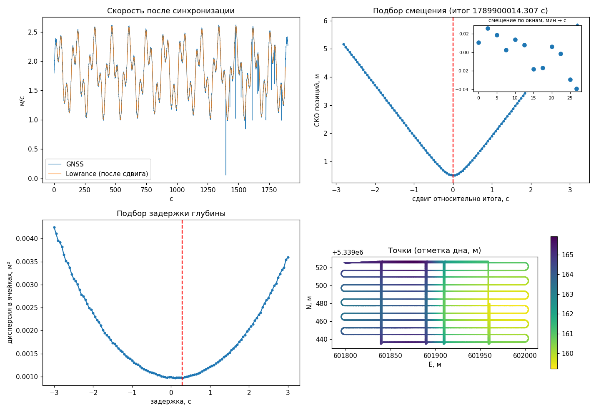

# sl2sync — привязка глубин Lowrance .sl2 к точному GNSS

Контекст задачи, формат sl2, алгоритм и планы: [docs/CONTEXT.md](docs/CONTEXT.md).

## Установка
    pip install -r requirements.txt

Для вкладки PPK в GUI дополнительно нужны бинарники RTKLIB demo5
(`convbin.exe`, `rnx2rtkp.exe`) — не через pip, скачать готовую сборку под
Windows с [rtklibexplorer/RTKLIB](https://github.com/rtklibexplorer/RTKLIB/releases)
и указать папку с ними на вкладке «Настройки» (группа «PPK»).

## CLI: sl2sync.py
    python sl2sync.py запись.sl2 трек.nmea --lever 0.5 0.3 --draft 0.1 --antenna-height 1.2 --auto-latency

GNSS-трек: NMEA-лог (GGA + RMC/ZDA), RTKLIB .pos (PPK), CSV с колонками
time, lat, lon[, h, q], или UBX (бинарный поток u-blox — NAV-PVT, либо
NAV-POSLLH+NAV-STATUS+NAV-TIMEUTC; подробности и оговорка про RTK — в
docs/CONTEXT.md).

### Основные параметры
- `--lever ВПЕРЁД ВПРАВО` — где датчик эхолота относительно GNSS-антенны, м.
- `--draft` — заглубление датчика под водой, м (keel offset в Lowrance поставьте 0).
- `--antenna-height` — высота антенны над водой, м; включает расчёт отметок дна (нужен RTK/PPK).
- `--auto-latency` — подбор остаточной задержки глубины по встречным/пересекающимся галсам.
- `--latency` — задать задержку вручную (если уже измерена).
- `--offset`, `--drift-ppm` — ручная синхронизация, если авто не сработала.
- `--min-fix fix` — брать только точки с RTK FIX.

### Результат (папка <имя>_out)
- `*_points.csv` — точки: время UTC, lat/lon, UTM, глубина, отметка дна, качество GNSS, курс.
- `*_depth.asc` / `*_zbottom.asc` + `.prj` — грид для QGIS (GeoTIFF, если установлен rasterio).
- `*_report.png` — графики синхронизации, подбора задержки и карта точек.
- `*_summary.json` — найденные смещение, дрейф, задержка и статистика.

Пример отчёта:

### Проверка на синтетике
    python make_test_data.py
    python sl2sync.py test.sl2 test_gnss.nmea --lever 0.5 0.3 --draft 0.1 --antenna-height 1.0 --auto-latency

## GUI: gui.py — «ОМДЖЕТ Гидро»
    python gui.py

Настольное окно (PySide6, иконка `assets/gidro.ico`, размер по умолчанию 1300×1000,
версия — в заголовке окна с префиксом «v» и в константе `APP_VERSION`) для просмотра
трека эхолота на карте, постобработки GNSS (PPK), построения изобат, подбора
временного смещения и полного расчёта `sl2sync.py` (экспорт CSV/грид/отчёта) —
всё внутри одного окна, без переключения на CLI.

Шапка окна (общая для всех вкладок): **Эхограмма** (файл .sl2), **Ровер**
(GNSS-трек — он же ровер для PPK), **База** (GNSS база для PPK). Ниже —
вкладки (в этом порядке):

- **Карта** — трек на карте, сводка, обрезка, раскраска подложки.
- **Эхограмма** — водопад сонара с метками и линейкой. См. ниже.
- **PPK** — постобработка GNSS-трека по паре ровер+база через RTKLIB demo5;
  свои независимые от шапки списки файлов, пакетный расчёт нескольких пар,
  подробности по каждому RINEX-файлу, мини-карта. См. ниже.
- **Расчёт смещения** — сравнение треков до/после синхронизации.
- **Построение изобат** — карта строится заново при каждом переключении на
  эту вкладку (подтягивает актуальный трек/подложку из «Карты»).
- **Донные отложения** — карта и статистика по экспериментальному индексу
  твёрдости дна (см. ниже).
- **Экспорт данных** — GUI-обёртка полного расчёта `sl2sync.py` (CSV/грид/
  отчёт/summary.json), с выбором системы координат для E/N и грида.
- **Справка** — инструкция по всем разделам приложения (тот же текст, что и
  в этом README, зашит прямо в код — доступен и в собранном .exe).
- **Настройки** — окраска глубин/донных отложений, трек, временная шкала,
  кэш карт, папка RTKLIB (для вкладки PPK), геометрия судна (смещение
  антенн), файл систем координат (для вкладки «Экспорт данных»), проверка
  обновлений.

Мелкий попап «Смещение по эхограммам» (раздельная правка глубины по файлам
мультиэхограммы) остаётся всплывающим окном.

### Загрузка данных
- **Файл эхограммы (.sl2)** — выбор одного файла сразу показывает трек на карте по
  встроенному GPS Lowrance (без GNSS-трека, без полной синхронизации). До загрузки
  какого-либо трека карта открывается на Омске (а не в океане у координат [0, 0]).
- **Вкладка «Эхограмма»** — водопад сонара по выбранному файлу (столбец —
  пинг, строка — глубина), раскрашенным той же радужной палитрой, что и точки
  на карте (слабый сигнал — синий, сильный — красный), с прокруткой. Работает
  только с одним файлом (мультиэхограмма не поддерживается); обновляется
  только когда меняется путь к файлу в шапке окна (само чтение/декодирование
  водопада не дешёвое). Столбцы калибруются по глубине через поле диапазона
  сонара `range_ft` (см. docs/CONTEXT.md) — Lowrance меняет диапазон показа
  автоматически ступенями, и без калибровки на границах смены диапазона на
  картинке виден резкий «шов» (разрыв текстуры). Раньше пробовали растягивать
  столбец под глубину ДНА пинга (depth_m) — предположение диапазон≈глубина
  оказалось неверным и давало ложные резкие скачки; `range_ft` — правильное
  поле для этого. Если поле не удалось прочитать — калибровка не выполняется,
  линейка показывает номер байта, как раньше.
  - Слева — линейка глубин в метрах (закреплена у края окна, не уезжает при
    горизонтальной прокрутке), снизу — ось времени/расстояния (настройка
    «Временная шкала»).
  - Под эхограммой — таймлайн: профиль глубины дна по сонару (depth_m),
    синхронизированный по горизонтали с прокруткой.
  - Наведение курсора на эхограмму рисует перекрестие с подписями (строка —
    слева от курсора, глубина в метрах при калибровке; время/расстояние —
    сверху) и подсвечивает то же место на таймлайне глубины.
  - Колесо мыши над изображением или линейкой — масштаб (0.1×–20×), ползунок
    «Контраст» — усиление контраста амплитуды. При уменьшении масштаба картинка
    перед показом честно усредняется по блокам (а не просто растягивается Qt) —
    иначе десятки тысяч пингов, сжатые в ширину окна, превращаются в зубчатые
    вертикальные полосы (алиасинг) вместо гладкого профиля дна.
  - Таймлайн под эхограммой размечен так же, как таймлайн главной карты:
    вертикальные линии сетки и подписи времени/расстояния снизу (та же
    настройка «Временная шкала»). Колесо мыши над таймлайном меняет масштаб
    эхограммы — тот же эффект, что и колесо над самим изображением.
  - **«Режим заметок»** — включите и кликните по эхограмме, чтобы поставить
    заметку с текстом в этом месте; список заметок справа, текст правится в
    поле «Текст заметки» под списком, «Удалить заметку» убирает выбранную.
    Ниже — мини-карта с треком текущего файла: при наведении курсора на
    эхограмму на ней жёлтой точкой показывается место на воде, соответствующее
    пингу под курсором.
  - **«Линейка»** — включите и кликните по двум точкам на эхограмме: покажет
    расстояние между ними по глубине и по времени/дистанции; «Сбросить
    линейку» убирает измерение.
  - **«Сохранить заметки» / «Загрузить заметки»** — заметки сохраняются в JSON
    рядом с файлом эхограммы (`<имя>_marks.json`).
- **Мультиэхограмма** — загрузка нескольких .sl2 по одному: после каждого файла
  вопрос «Загрузить ещё?» (Да → выбрать следующий, Нет → показать то, что уже
  загружено). Точки всех файлов объединяются на одной карте с общей шкалой окраски
  по глубине.
- **Закрыть эхограммы** — выгружает все загруженные файлы, сбрасывает карту и сводку.
- **Ровер** (GNSS-трек) — выбор одного файла (NMEA/.pos/CSV/UBX) для расчёта
  смещения; это же поле — ровер для вкладки PPK. **Мультитрек** — так же, по
  одному файлу с вопросом «Загрузить ещё?»; несколько треков объединяются в
  один по времени. **Закрыть** — выгружает GNSS-трек(и). Если выбран файл
  `.ubx`, он же автоматически добавляется в список роверов на вкладке PPK
  (без дублей при повторном выборе того же файла); файлы других форматов туда
  не переносятся, PPK их не обрабатывает.
- **База** (GNSS база) — файл `.ubx` базовой (стационарной) станции, нужен
  только для вкладки PPK; выбранный файл так же автоматически добавляется в
  список баз на этой вкладке.

Диалоги выбора файлов запоминают последнюю открытую папку между запусками программы.
Рядом с полями выбора файла эхограммы, GNSS-трека и уреза воды (в окне изобат) —
значок «?»: наведение курсора показывает всплывающую подсказку с описанием
принимаемых форматов.

### Вкладка «Расчёт смещения»
Кнопка **«Рассчитать смещение»** (активна при выбранных эхограмме и GNSS-треке;
работает только с одним файлом эхограммы, не с мультиэхограммой) запускает ту же
оценку временной привязки, что и `sl2sync.py` (грубое смещение по кросс-корреляции
скорости + уточнение по траектории), и строит на этой же вкладке подробный отчёт
и две карты.

Отчёт («Детали расчёта смещения»): уточнённое смещение; грубое смещение и качество
кросс-корреляции скорости (NCC, с пометкой «слабая/средняя/хорошая»); СКО позиций
после синхронизации; предупреждение, если уточнённая точка оказалась на краю окна
поиска (возможно, истинное смещение вне проверенного диапазона); дрейф часов
эхолота (ppm и секунды за запись, по скольким окнам с поворотами оценён — либо
«не оценивался», если запись короче 10–15 мин); начало/конец записи по GNSS;
диапазон глубин, по которому раскрашены треки на картах ниже.

У каждой строки отчёта — значок «?» с пояснением, что означает параметр и как
он связан с остальными.

Карты: слева — сырой трек эхолота и GNSS-трек до синхронизации (виден сдвиг),
справа — после (треки должны совпасть). Трек эхолота на обеих картах окрашен по
глубине той же радужной палитрой, что на основной карте (минимум — красный,
максимум — синий, единая шкала на обеих картах для честного сравнения, линии
вдвое толще обычного для лучшей видимости); GNSS-трек — сплошной синей линией
(глубины у него нет). Пан и зум одной карты сразу повторяются на второй; наведение
курсора на точку трека с глубиной подсвечивает ту же точку на второй карте (или
ближайшую доступную — «до» и «после» синхронизации это разные подмножества пингов:
не у каждого пинга нашёлся годный фикс встроенного GPS Lowrance и годная
интерполированная позиция на GNSS-треке одновременно, сопоставление идёт по
настоящему номеру пинга, а не по позиции в массиве точек) и показывает её глубину —
удобно сверять одно и то же место трека до/после синхронизации. Если загружен ровно
один файл эхограммы, заодно
уточняются «Начало» и «Конец» трека в сводке — настоящим UTC-временем из
синхронизации с GNSS (см. ниже, почему это надёжнее времени файла).

### Вкладка «Построение изобат»
Слева — настройки (25% ширины окна), справа — карта или 3D-вид дна
(переключатель **«Карта» / «3D дно»** над картой). Карта перестраивается
заново при каждом переключении на вкладку (подтягивает актуальный трек и
подложку из «Карты»; уже построенные изобаты/урез при этом не пропадают, но
не будут видны поверх новой карты, пока не нажать «Построить» заново). Трек
на этой карте всегда показан красным (в т.ч. до построения).
- **«Скрыть трек»** — переключатель, скрывает/показывает красный трек на карте.
- **Шаг изобат**, **Ячейка сетки** (интерполяции) и **Сглаживание** — параметры
  расчёта. Сглаживание — гауссово размытие грида глубин (в ячейках сетки, 0 —
  без сглаживания) перед построением линий, заливки и 3D-меша; действует на
  всё одинаково, применяется по кнопке «Построить».
- **«Точки»** — ручная чистка явных выбросов промера (шум, всплытие датчика и
  т.п.), которые портят интерполяцию. Кнопка **«Удалить точки»** включает
  режим: клик по точке трека на карте исключает её из расчёта изобат (клик по
  ней ещё раз — вернуть обратно); счётчик «Исключено точек: N»; **«Восстановить
  все»** возвращает все точки разом. Исключение сбрасывается автоматически при
  загрузке записи с другим числом точек.
- **«Урез»** — линии уреза воды (граница вода/суша, глубина всегда 0 м) и линии
  русла (продолжение интерполяции от ближайших реальных промеров, без
  выдумывания глубины — полезно направить сетку по фарватеру там, где промеров
  мало). Линий каждого типа может быть несколько.
  - **«Загрузить урез»** — CSV (колонки `lat`/`lon`) или обычный текст с парами
    чисел `lat lon` — всегда считается урезом; либо **KML**, где цвет линии
    стиля определяет тип: оранжевая/красная — урез, голубая/синяя — русло;
    линии без стиля — тоже урез (для простых KML без оформления). Каждый
    `Placemark`/`LineString` в KML — отдельная линия. Точки добавляются к уже
    нарисованным, а не заменяют их.
  - **«Нарисовать урез» / «Нарисовать русло»** — режим рисования кликами по
    карте (урез — оранжевым, русло — голубым). **Клик** — точка (концы линий
    притягиваются друг к другу в пределах ~15 px — так урез и русло удобно
    «сшивать» топологически). **ПКМ** — закончить текущую линию (следующий
    клик начнёт новую), а если рисование не активно — удалить линию под
    курсором целиком. **Ctrl+клик** — вставить точку в ближайшую линию.
    **Shift+клик** — удалить ближайшую точку (если у линии не остаётся точек —
    удаляется целиком).
  - Чекбокс **«Сглаживание»** — сглаживает острые углы нарисованных линий
    (алгоритм Chaikin corner-cutting; начальная и конечная точки каждой линии
    остаются на месте) — виден сразу на карте и учитывается при построении.
    Чекбокс **«Скрыть»** — скрывает обе линии на карте, не удаляя точки.
  - Изобаты доходят до нарисованных линий, даже если урез — открытая линия
    (не замкнутый контур) или короткий фрагмент, и даже в заливах/бухтах, куда
    лодка не подходила вплотную к берегу: интерполяция внутри контура,
    заданного урезом, дозаполняется ближайшим соседом, а не обрывается по
    случайному пределу выпуклой оболочки промеров. Русло аналогично
    принудительно считается водой в полосе вокруг линии, даже если урез его не
    накрывает.
- **«Линии изобат»** — чекбокс «Отображать линии», толщина (дробная, шаг 0.25, по
  умолчанию 1) и цвет линий (по умолчанию чёрный, выбор через `QColorDialog`).
- **«Подписи изобат»** — чекбокс «Отображать подписи», размер шрифта и ползунок
  «Частота подписей» (через сколько точек линии повторять подпись глубины);
  тем же шрифтом подписываются и диапазоны глубин внутри залитых областей (см.
  ниже), по одной подписи в центре области. Чекбокс **«Только цифры, без
  фона»** убирает фоновый прямоугольник у подписей (и линий, и диапазонов
  заливки), оставляя только текст с чёрной обводкой. Повторяющиеся подписи с
  одинаковым значением, оказавшиеся рядом (в радиусе 4 высот шрифта на
  экране), не печатаются по второму разу — иначе на извилистых линиях одно и
  то же число может напечататься почти вплотную несколько раз подряд.
- **«Заливка изобат»** — чекбокс «Отображать заливку», прозрачность и число
  ступеней перехода цвета от минимальной глубины к максимальной: 0 — заливка
  одним цветом без переходов, N — плавный переход через N цветов (по
  умолчанию 8). Все кольца одного диапазона (внешняя граница и вложенные
  «дырки», где начинается более глубокий диапазон) рисуются одной фигурой с
  правилом заливки evenodd — иначе прозрачность в местах наложения диапазонов
  выглядела плотнее, чем на краю. Справа внизу карты показывается легенда —
  вертикальная полоса с делениями, построенная из фактических цветов
  диапазонов (а не заново по формуле), поэтому всегда совпадает с окраской на
  карте; скрывается вместе с чекбоксом «Отображать заливку» и при удалении
  изобат.
- **«Построить»** — грид глубин линейной интерполяцией (`scipy.griddata`) и линии
  постоянной глубины + залитые диапазоны через `matplotlib.contour`/`contourf`,
  отрисованные поверх карты, плюс меш для 3D-вида (см. ниже). Изменение
  настроек линий/подписей/заливки после построения перерисовывает уже
  построенные изобаты сразу, без повторного расчёта (шаг/ячейка/сглаживание/
  урез/русло/исключённые точки требуют повторного нажатия «Построить»).
- **«Удалить изобаты»** — убирает с карты построенные линии, заливку, подписи и
  легенду заливки (трек и урез/русло остаются).
- **«Сохранить»** — меню выбора формата; пока реализовано только сохранение
  изображения карты (PNG) как есть на экране.

### 3D-вид дна
Переключатель **«3D дно»** над картой на вкладке «Построение изобат» — тот же
грид глубин, что и для изобат (учитывает урез/русло/сглаживание/исключённые
точки), но отрисованный как поверхность в Three.js (загружается с CDN тем же
способом, что и Leaflet, в отдельном `QWebEngineView`). Окраска — та же
палитра, что на 2D карте (мельче — красный, глубже — синий), с освещением для
читаемости рельефа; ячейки без данных — дыры в поверхности, как пустая
область на 2D карте. Управление: ЛКМ — вращение, колесо — зум, ПКМ — сдвиг
(Three.js `OrbitControls`). Ползунок **«Преувеличение рельефа»** (1–30×,
по умолчанию 3×) меняет вертикальный масштаб мгновенно, без пересчёта —
глубина обычно мала по сравнению с площадью акватории, без преувеличения
рельеф почти не виден. Пересобирается автоматически при каждом нажатии
«Построить».

### Панели слева от карты (сверху вниз)
- **«Сводка»** — блок «Дата» (начало, конец, продолжительность трека; при
  мультиэхограмме — прочерк, так как файлы могут быть с разных выходов), блок
  «Скорость» (макс./средняя по встроенному GPS Lowrance), блок «Расстояние»
  (протяжённость трека после обрезки) и блок «Глубины» (макс./мин./средняя по
  точкам, уже после обрезки и смещения). Начало/конец трека берутся из самого
  файла .sl2 — из поля с настоящим unix-временем начала записи (осмысленное
  значение оно несёт только в первом кадре, см. docs/CONTEXT.md), а не из времени
  изменения файла на диске: mtime зависит от того, как файл попал на компьютер
  (копирование с карты памяти может исказить дату) и ненадёжен. Если поле в файле
  не распознано, используется старый способ (mtime минус длительность записи) как
  запасной вариант; расчёт смещения с GNSS (см. выше) даёт ещё более точное время.
- **«Обрезка»** — отрезает точки с начала и с конца трека. Переключатель «Время»
  (секунды от начала записи) / «Расстояние» (метры вдоль трека) — активны только
  поля выбранного режима.
- **«Смещение»** — сдвигает глубину на заданное число сантиметров (например,
  компенсация осадки/выноса датчика). «Для всех» — одно значение на все загруженные
  эхограммы; «Раздельно» — открывает окно со своим смещением для каждого файла
  (по имени).

Обрезка и смещение пересчитывают карту и сводку сразу, без повторного чтения файлов.

### Карта и таймлайн
- Точки раскрашены радужной палитрой; выпадающий список «Раскраска» переключает,
  по чему красить: **«Глубина»** (минимум — красный, максимум — синий),
  **«Твёрдость дна»** (см. ниже) или **«Нет»** (все точки одним цветом). Легенда —
  вертикальная, тёмная полупрозрачная, в правом нижнем углу карты, с делениями
  (как на линейке) и заголовком текущего слоя.
- Если загружен GNSS-трек, он сразу показывается на карте тонкой красной линией
  (без ожидания расчёта смещения — просто как есть, до синхронизации). Чекбокс
  **«Скрыть GNSS трек»** (под строкой выбора фотоподложки, слева) скрывает её.
- Зелёный флажок отмечает начало трека, красный — конец; чёрная точка с подписью —
  место максимальной глубины трека. Чекбокс **«Скрыть начало/конец треков»** (под
  строкой выбора фотоподложки) скрывает все три маркера.
- Чекбокс **«Скорость на треке»** (рядом с предыдущим) включает вдоль трека
  свечение, окрашенное по скорости (та же радужная палитра, что у точек): широкая
  полупрозрачная обводка и более яркая узкая поверх неё, обе рисуются в отдельном
  слое строго под точками трека, не перекрывая их сверху. В этом режиме точки,
  окрашенные по глубине/твёрдости, и маркер максимальной глубины не показываются
  (только скорость, без смешения с другой раскраской), легенда глубины справа
  снизу скрывается и вместо неё показывается легенда скорости (та же радужная
  шкала, что и у самого свечения). Красная точка с подписью отмечает место
  максимальной скорости — она видна независимо от этого чекбокса, пока не включён
  «Скрыть начало/конец треков».
- Наведение курсора на точку трека на карте показывает её глубину во всплывающей
  подсказке, ставит на это место жёлтый маркер и подсвечивает соответствующее
  место на таймлайне под картой — и наоборот.
- **Таймлайн** под картой — профиль глубины по всем точкам трека с разметкой оси
  (время или расстояние — переключается в настройках). Наведение курсора на
  таймлайн двигает жёлтый маркер по треку на карте и показывает глубину в этой точке.
- Подложка — Google Спутник или Google Карта.

### Твёрдость дна (экспериментально)
При загрузке эхограммы по сырым байтам каждого пинга (см. вкладку «Эхограмма»)
считается грубый индекс твёрдости дна: резкость/ширина первого пика (резче — твёрже)
и наличие второго эха на удвоенной глубине (сигнал поверхность→дно→поверхность→дно,
обычно заметен только на твёрдом дне). Индекс не откалиброван и не привязан к
реальным типам грунта — это относительный показатель 0..1 для сравнения точек между
собой в пределах одного трека, а не измерение, как у специализированных систем
классификации дна (RoxAnn, QTC, BioSonics). См. `estimate_bottom_hardness_ping` и
`compute_hardness_index` в gui.py.

Ширина пика переводится из байт в метры через поле диапазона сонара `range_ft`
(см. docs/CONTEXT.md) — без этого резкость систематически получалась «мягче» на
большем диапазоне (меньше байт на метр) независимо от реальной твёрдости дна.

Проверено на двух реальных записях: индекс осмысленно распределён почти по всему
диапазону 0..1 (не вырождается в константу) и заметно варьируется даже в узком
окне глубин (5–8 м: std 0.12 при общем std 0.15 — сигнал не сводится к одной
глубине). При этом после калибровки видна умеренная **отрицательная** корреляция
с глубиной (−0.5…−0.6) — правдоподобно объясняется расширением диаграммы
направленности луча с дистанцией (пятно на дне растёт с глубиной, эхо размывается
по времени сильнее на любом грунте), а не свойством самого сонара. Это известное
ограничение однолучевых эхолотов без поправки на геометрию луча — сравнивать по
этому индексу стоит точки на близкой глубине.

### Вкладка «Донные отложения»
Аналитика по индексу твёрдости дна (см. выше) — карта с той же окраской, что
«Раскраска: Твёрдость дна» на вкладке «Карта», гистограмма распределения
индекса и статистика (среднее/медиана/std/мин/макс, корреляция с глубиной).
Обновляется при каждом переключении на вкладку (просто перечитывает уже
посчитанные точки, без пересчёта). Диапазон и число ступеней окраски — в
настройках, группа «Окраска донных отложений».

### Вкладка «PPK»
Постобработка (Post-Processing Kinematic) GNSS-трека по паре ровер+база через
RTKLIB demo5 (`convbin` + `rnx2rtkp`, см. `ppk_module.py`) — из сырого
одиночного/DGPS фикса получается решение с фиксацией целочисленных
неоднозначностей фазы (RTK FIX, точность до сантиметров). Работает с `.ubx`
(сырой поток u-blox), уже готовым RINEX OBS (`.obs`/`.rnx`/`.NNo` по годовому
суффиксу — например, `.24o`) и с такими же файлами, сжатыми gzip (`.gz`,
распаковываются во временную рабочую папку автоматически). Приёмники без
своего RINEX-конвертера обычно поставляются с отдельной программой для этого
(например, EFT M4 → EFT PP, ComNav → Compass) — результат такой конвертации
(файлы `.obs`/`.nav` или с расширением по году) можно грузить сюда напрямую.
Во всех файлах результата (`.obs`/`.nav`/`.conf`/`.pos`, которые создаёт эта
вкладка в рабочей папке) имя начинается с оригинального имени исходного
файла — чтобы результаты нескольких пар не путались между собой в одной
папке.

- **Файлы** — свои списки роверов и баз, независимые от полей в шапке окна
  (хотя `.ubx`-файлы, выбранные в шапке, тоже сюда попадают, см. выше):
  «Добавить ровер(ы)…»/«Добавить баз(ы)…» (можно сразу несколько файлов),
  «Удалить выбранный». Списки — по 2 строки высотой, с прокруткой; между
  списком роверов и баз — вертикальный разделитель.
- **Таймлайн** под списками: зелёные полосы — роверы, красные — базы, имя
  файла подписано прямо на полосе, время (UTC) — на отдельной шкале сверху;
  сразу видно начало/конец записи каждого файла и их взаимное перекрытие
  (перекрытие обязательно для расчёта пары).
- **«Запустить PPK»** — для каждого ровера сам находит базу с максимальным
  перекрытием по времени и считает пары последовательно (одну за другой).
  Дополнительное условие: запись ровера должна быть короче записи базы —
  иначе база не покрывает весь период съёмки ровера целиком, и пара
  пропускается с предупреждением вместо расчёта. Во время расчёта статус
  показывает процент выполнения по числу пар («Обработка… 50% (пара 2 из
  4)…»); один расчёт пары может занимать несколько минут (конвертация
  UBX→RINEX + `rnx2rtkp`).
- Настройки RTK (у каждого поля — значок «?» с пояснением): системы (по
  умолчанию `GREC`), маска возвышения, AR ratio, AR mode (Continuous/Fix and
  hold), ГЛОНАСС AR (Вкл./Autocal/Выкл.), частота (L1/L1+L2); группа
  «Координаты базы» — одиночное решение по записи / из заголовка RINEX /
  точные координаты (широта, долгота, высота — вручную, друг под другом).
  Путь к папке RTKLIB (`convbin.exe`/`rnx2rtkp.exe`) задаётся один раз на
  вкладке «Настройки» (см. ниже), не здесь.
- Раскладка низа вкладки — три колонки: настройки (ровно 25% ширины окна),
  результат (50%: список пар сверху — 2 строки с прокруткой, карта снизу —
  остальное место), подробности (25%, во всю высоту).
- **Результат** — список пар «ровер + база: fix/float/single %»; у пары, где
  обнаружены временны́е метки (event-эпохи RINEX, flag=5 — например, от
  внешнего синхроимпульса), — красный кружок с «!» и число меток в строке.
  При выборе пары:
  - мини-карта (спутниковая подложка): трек ровера по решению RTKLIB
    (зелёная линия) и флажок 🚩 на месте базы (координаты из заголовка
    RINEX), обе подписаны именами файлов; если подписи попадают в одно место
    экрана (типично — ровер стартует рядом с базой), они разводятся в
    стороны и соединяются с истинной точкой тонкой пунктирной «полкой»;
  - панель «Подробности» — сводка PPK (fix/float/single %, СКО фикса) и по
    каждому файлу пары: период записи, длительность, интервал, число эпох и
    временны́х меток, системы+сигналы+число спутников (GPS/ГЛОНАСС/Galileo/
    BeiDou/QZSS/SBAS), координаты приёмника из заголовка (ECEF и WGS84),
    модель приёмника, версия RINEX (парсится `ppk_module.rinex_obs_info` —
    построчно, без разбора самих измерений, быстро даже для файлов в сотни
    МБ).
- **«Использовать выбранный результат как ровер»** — подставляет `.pos`
  выбранной пары в поле «Ровер» шапки окна и сразу показывает трек на
  карте.

### Вкладка «Экспорт данных»
GUI-обёртка полного расчёта `sl2sync.py` — те же параметры, что у CLI
(`build_parser()`/`run()`), сгруппированные как «Синхронизация» / «Геометрия»
/ «Фильтрация и грид», плюс:
- **Система координат** — для колонок `E_.../N_...` в `_points.csv` и для
  грида/`.prj`. По умолчанию «WGS84 / UTM (авто, по данным)» — прежнее
  поведение (автоподбор зоны UTM). Местные системы координат (МСК) читаются
  из текстового файла `coord_systems.txt` (см. ниже). Кнопка «Добавить по
  EPSG-коду…» добавляет в список любую систему по номеру EPSG (проверяется
  через `pyproj`), выбор сохраняется между запусками.
- **«Запустить расчёт»** → тот же `sl2sync.run()`, что и CLI; результат —
  список файлов (двойной клик открывает содержащую папку) и сводка (число
  точек, диапазон глубин, найденные смещение и задержка, система координат).
- Работает только с одним файлом эхограммы и одним GNSS-треком (как CLI).

### Файл `coord_systems.txt`
Местные системы координат (МСК) для списка на вкладке «Экспорт данных» —
читаются заново при каждом запуске программы; новые можно дописывать вручную,
без правки кода. Формат строки — как в `mapinfow.prj` (Gauss-Kruger/tmerc,
датум Пулково-1942, эллипсоид Красовского):

    "имя", 8, 1001, 7, центральный_меридиан, 0, 1, ложное_смещение_E, ложное_смещение_N

Поддерживается только id проекции `8` (Gauss-Kruger/tmerc — единственный
встретившийся формат). Строка, не подходящая под этот шаблон (обычный текст
без кавычек в начале строки), считается заголовком раздела и добавляется к
названию всех систем ниже неё, до следующего такого заголовка — поэтому
присланные блоки описания можно вставлять в файл как есть, без
переформатирования. Открыть файл в текстовом редакторе — кнопкой «Открыть
список…» на вкладке «Настройки» (группа «Система координат»); если файла ещё
нет, он создаётся с пояснительным заголовком. После правки файла программу
нужно перезапустить, чтобы список подхватился.

Параметры перехода в WGS84 (`towgs84`) — общероссийские усреднённые (точность
порядка метра), региональных уточнений по конкретным областям нет. Уже
заведены: МСК-55 (Омская обл., 2 зоны), МСК-54 (Новосибирская обл., 4 зоны),
МСК Тюменской обл. (6 зон по 1.5°), МСК-72 (Тюменская обл., 5 зон по 3° + 3
зоны по 6°), МСК-66 (Свердловская обл., 2 зоны по 6° + 3 зоны по 3°,
справочно).

### Настройки
Раскладка — парами колонок (слева/справа), группы по смыслу:
- **Окраска глубин** / **Окраска донных отложений** — у каждой: автоматическая
  (мин/макс берутся с эхограммы, по умолчанию) или ручная (свои мин/макс), и
  число ступеней окраски (2–128, дискретные полосы цвета вместо непрерывного
  градиента).
- **Трек** — толщина линии трека и толщина линии скорости (обе в пикселях; см.
  «Скорость на треке» выше). / **Временная шкала** — разметка оси таймлайна:
  «Время» (мин:с от начала) или «Расстояние» (м/км вдоль трека).
- **Кэш** — текущий размер кэша карт, кнопка «Очистить кэш», отведённый объём под
  кэш (по умолчанию 1024 МБ). / **PPK** — папка RTKLIB demo5 (с
  `convbin.exe`/`rnx2rtkp.exe`) для вкладки PPK; сохраняется сразу по выбору,
  без кнопки «Применить».
- **Система координат** — кнопка «Открыть список…» открывает `coord_systems.txt`
  в текстовом редакторе (см. выше). / **Геометрия судна** — кнопка «Смещение
  антенн…» открывает окно со схемой судна (вид с борта и сверху) и полями
  выноса вперёд/вправо, осадки и высоты антенны — те же параметры, что в
  группе «Геометрия» на вкладке «Экспорт данных» (`--lever`/`--draft`/
  `--antenna-height` sl2sync.py), сохраняются как значения по умолчанию, чтобы
  не вводить их заново на каждый расчёт, если геометрия судна/оборудования не
  меняется между выходами.
- **Обновления** — текущая версия и дата (`APP_VERSION`/`APP_VERSION_DATE`),
  кнопка «Проверить обновления» (сверяет с последним релизом на GitHub
  `andrewkena/omjet-gidro`, при наличии новой версии предлагает открыть
  страницу релиза — та же проверка выполняется автоматически и тихо при
  запуске программы, без окон, если обновлений нет) и кнопка «Перейти на
  GitHub» (открывает страницу репозитория в браузере).

### Вкладка «Справка»
Инструкция по всем разделам приложения — тот же материал, что и в этом
README, но зашит прямо в код (`HELP_HTML` в gui.py), поэтому доступен
одинаково и при запуске из исходников, и в собранном .exe, без зависимости от
файла README.md рядом.

### Сборка EXE и установщика (Windows)
    pip install pyinstaller
    pyinstaller OMJET_Gidro.spec

Готовый `dist/OMJET_Gidro.exe` — однофайловая сборка (~280 МБ, PySide6 с
QtWebEngine занимает большую часть размера), без установки Python.

Установщик собирается [Inno Setup 6](https://jrsoftware.org/isinfo.php)
(бесплатный) из уже готового `dist/OMJET_Gidro.exe`:

    "C:\Program Files (x86)\Inno Setup 6\ISCC.exe" OMJET_Gidro.iss

Результат — `installer_dist/OMJET_Gidro_Setup_<версия>.exe`: ставит программу
в `Program Files`, копирует рядом `coord_systems.txt` (не перезатирая, если
пользователь уже отредактировал его при обновлении версии) и `README.md`,
создаёт ярлыки в меню «Пуск» и (по желанию) на рабочем столе, добавляет
деинсталлятор. Версию в `OMJET_Gidro.iss` (`MyAppVersion`) нужно обновлять
вручную вместе с `APP_VERSION` в gui.py.

И exe, и установщик собираются локально (не в git — оба каталога, `dist/` и
`installer_dist/`, в `.gitignore`) и прикладываются к релизу на странице
[Releases](https://github.com/andrewkena/omjet-gidro/releases).

### Технические заметки
- Карта встроена через `QWebEngineView` + Leaflet.js. В этом окружении обнаружено,
  что вызов `QWebEngineView` из обработчика, вызванного через `QThread`-сигнал между
  потоками, приводит к падению процесса — поэтому все фоновые операции (чтение
  эхограмм, расчёт смещения, проверка обновлений) используют обычный
  `threading.Thread` с опросом через `QTimer` (`run_async` в gui.py), а не
  `QThread`/`Signal`.
- `QWebEnginePage.setHtml()` молча обрезает контент больше ~2 МБ — при десятках
  тысяч точек карта грузится через временный HTML-файл (`load_html`), с уникальным
  именем на каждую перерисовку (Chromium иначе кэширует `file://` по пути и не видит
  изменений).
- Редактор линий уреза/русла и очистка точек на вкладке изобат ведут своё
  состояние прямо в JS (добавление/вставка/удаление точек и целых линий,
  прилипание концов, курсор) и после каждого изменения присылают в Python
  полное состояние целиком через `QWebChannel` (`IsobathsLinesBridge`) — так
  надёжнее, чем поштучно синхронизировать каждую правку в обе стороны. На
  вкладке сравнения треков (`OffsetTab`) другой механизм (`TrackCompareBridge`)
  связывает уже две карты между собой — движение (пан/зум) и наведение на
  точку транслируются через Python, потому что это две разные страницы в
  разных `QWebEngineView` без прямой связи между их JS. Во всех остальных
  картах данные идут только Python → JS (перегенерацией HTML или
  `runJavaScript`).
- 3D-вид дна (вкладка изобат) — Three.js (r128, UMD-сборка + `OrbitControls`
  из `examples/js`, а не ES-модули — проще подключить как обычный `<script>` с
  CDN, без сборщика) в отдельном `QWebEngineView`, рядом с 2D картой в
  `QStackedWidget`. Грид глубин перед отправкой в браузер уменьшается до
  разумного размера (`_build_terrain_mesh`, не больше ~120×120 вершин) —
  полный грид (до 4 млн ячеек) незачем гонять через JSON в JS ради превью.
- Вкладки собраны в `gui.py` как отдельные классы `QWidget` (`IsobathsTab`,
  `OffsetTab`, `PPKTab`, `ExportTab`, `SettingsTab`, `EchogramTab`,
  `SedimentsTab`, `HelpTab`), а не диалоги — так и карта изобат, и сравнение
  треков, и результаты PPK, и водопад сонара с заметками видны сразу, без
  модальных окон. Мелкий попап `DepthOffsetDialog` (раздельное смещение по
  файлам мультиэхограммы) остался диалогом — его состояние не нужно хранить
  между открытиями; `AntennaOffsetDialog` (Настройки → «Смещение антенн…») —
  тоже диалог, но со значениями по умолчанию, сохраняемыми в `QSettings`.
- Для собранного .exe (PyInstaller, onefile) путь к `coord_systems.txt`
  считается от `sys.executable` (папка рядом с .exe), а не от `__file__` —
  иначе правки пользователя терялись бы при каждом перезапуске, так как
  `__file__` внутри onefile-сборки указывает на временную распаковку
  (`sys._MEIPASS`), которая создаётся заново на каждый старт. Иконка окна,
  наоборот, читается из `sys._MEIPASS` — она вшита в exe и не должна лежать
  рядом отдельным файлом.
